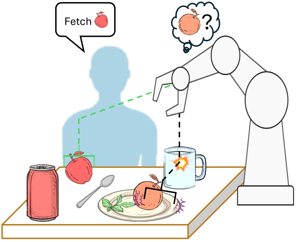
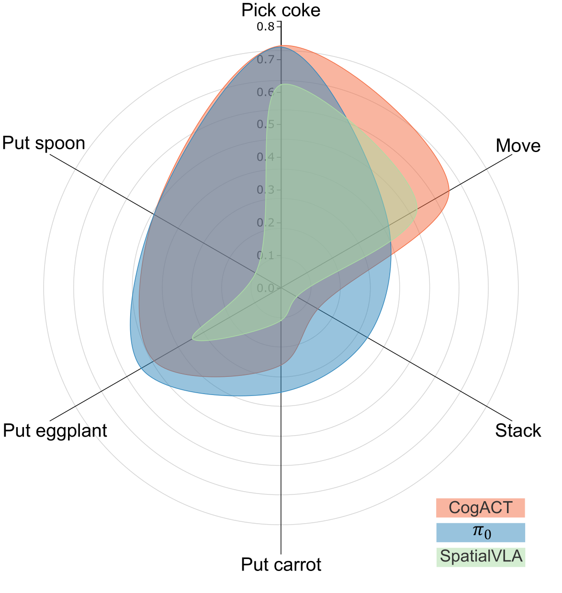

<div align="center">

# Distracted Robot
### How Visual Clutter Undermine Robotic Manipulation

**Preprint**

Amir Rasouli, Montgomery Alban, **Sajjad Pakdamansavoji**, Zhiyuan Li, Zhanguang Zhang, Aaron Wu, Xuan Zhao

Huawei Technologies Canada

[](https://arxiv.org/abs/2511.22780)
[](https://sajjadpsavoji.github.io/Distracted-Robot/)
[](https://huggingface.co/papers/2511.22780)
[](LICENSE)

</div>



---

> **Note**
> This repository is a placeholder. The paper and project page are live; **code release is in progress**.
> Watch or star the repo to be notified when it lands.

## Abstract

In this work, we propose an evaluation protocol for examining the performance of robotic manipulation policies in cluttered scenes. Contrary to prior works, we approach evaluation from a psychophysical perspective, therefore we use a unified measure of clutter that accounts for environmental factors as well as the distractors quantity, characteristics, and arrangement. Using this measure, we systematically construct evaluation scenarios in both hyper-realistic simulation and real-world and conduct extensive experimentation on manipulation policies, in particular vision-language-action (VLA) models. Our experiments highlight the significant impact of scene clutter, lowering the performance of the policies, by as much as 34% and show that despite achieving similar average performance across the tasks, different VLA policies have unique vulnerabilities and a relatively low agreement on success scenarios. We further show that our clutter measure is an effective indicator of performance degradation and analyze the impact of distractors in terms of their quantity and occluding influence. At the end, we show that finetuning on enhanced data, although effective, does not equally remedy all negative impacts of clutter on performance.

## News

- **2026-09** &mdash; Paper released on [arXiv](https://arxiv.org/abs/2511.22780) and indexed on [Hugging Face](https://huggingface.co/papers/2511.22780).
- **2026-09** &mdash; Project page live at [sajjadpsavoji.github.io/Distracted-Robot](https://sajjadpsavoji.github.io/Distracted-Robot/).

## Getting Started

_Code coming soon._ The intended entry point:

```bash
git clone https://github.com/SajjadPSavoji/Distracted-Robot.git
cd Distracted-Robot
pip install -r requirements.txt
```

## Results



_Add a quantitative results table here._

## Citation

If you find this work useful, please cite:

```bibtex
@article{rasouli2025distracted,
  title   = {Distracted Robot: How Visual Clutter Undermine Robotic Manipulation},
  author  = {Amir Rasouli and Montgomery Alban and Sajjad Pakdamansavoji and Zhiyuan Li and Zhanguang Zhang and Aaron Wu and Xuan Zhao},
  journal = {arXiv preprint arXiv:2511.22780},
  year    = {2025}
}
```

## Links

- 📄 [Paper (arXiv)](https://arxiv.org/abs/2511.22780)
- 🌐 [Project page](https://sajjadpsavoji.github.io/Distracted-Robot/)
- 🤗 [Hugging Face](https://huggingface.co/papers/2511.22780)
- 👤 [Google Scholar](https://scholar.google.com/citations?user=DZzLzNwAAAAJ)
- 💼 [LinkedIn](https://www.linkedin.com/in/sajjad-pakdaman-savoji/)
- ✉️ [sj.pakdaman.edu@gmail.com](mailto:sj.pakdaman.edu@gmail.com)

## Contact

For questions about the paper, data, or code release, contact
**Sajjad Pakdamansavoji** &mdash; [sj.pakdaman.edu@gmail.com](mailto:sj.pakdaman.edu@gmail.com).

## Acknowledgements

*Corresponding author · †Work done while at Huawei Canada

## License

Released under the [MIT License](LICENSE).
